# System Flow Documentation

## Overview

This document outlines all critical user flows, system processes, and data flows within the LMS platform. Each flow includes detailed steps, decision points, error handling, and success criteria.

## Authentication Flows

### User Registration Flow

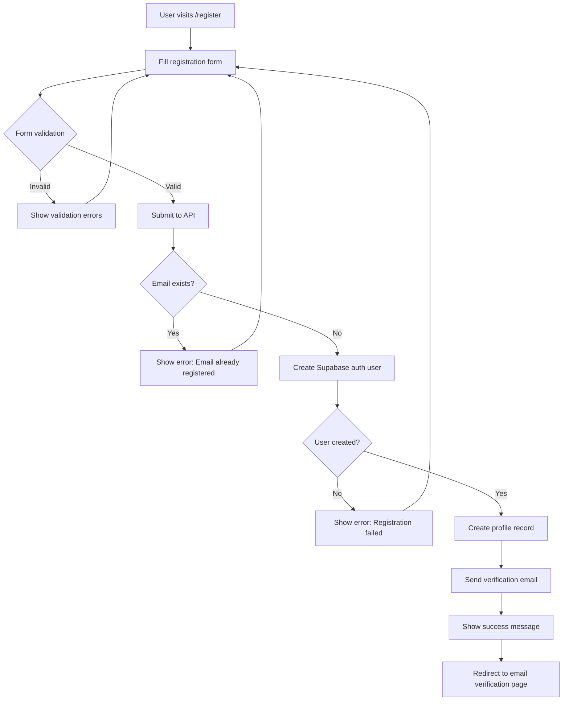

**Detailed Steps:**

1. **Form Submission**
   - User enters: email, password, full name, username
   - Frontend validation: email format, password strength, username availability
   - Real-time username availability check via API

2. **Backend Processing**
   - Validate input with Zod schema
   - Check email uniqueness in Supabase Auth
   - Create user account with `supabase.auth.signUp()`
   - Create profile record in profiles table
   - Handle any errors (email exists, weak password, etc.)

3. **Email Verification**
   - Supabase sends verification email automatically
   - User clicks verification link
   - Redirects to `/auth/callback` with verification token
   - User is automatically signed in after verification

**Error Handling:**
- Network errors: Show retry option
- Validation errors: Highlight specific fields
- Email already exists: Suggest login or password reset
- Username taken: Suggest alternatives

### User Login Flow

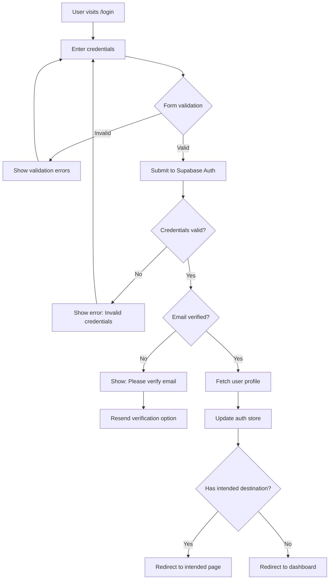

**Detailed Steps:**

1. **Credential Validation**
   - Email format validation
   - Password minimum length check
   - Submit via `supabase.auth.signInWithPassword()`

2. **Post-Login Processing**
   - Fetch user profile from profiles table
   - Update Zustand auth store
   - Set up real-time subscriptions
   - Redirect based on user role and intended destination

**Error Handling:**
- Invalid credentials: Clear form, show error
- Unverified email: Show verification options
- Account locked: Show contact support
- Network issues: Show retry button

### Password Reset Flow

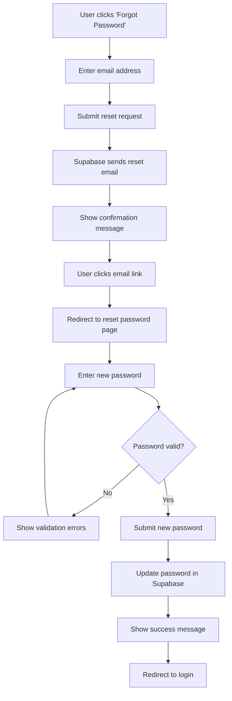

## Course Enrollment Flow

### Free Course Enrollment

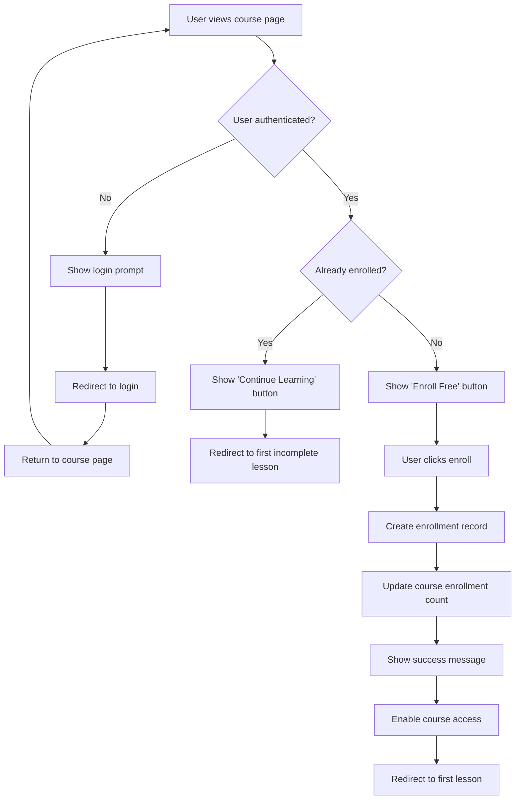

### Premium Course Enrollment

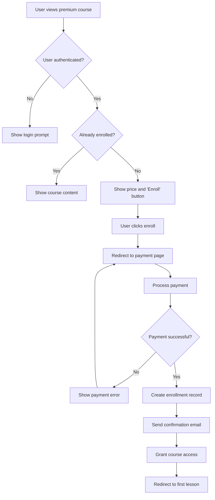

## Lesson Learning Flow

### Lesson Access and Progress

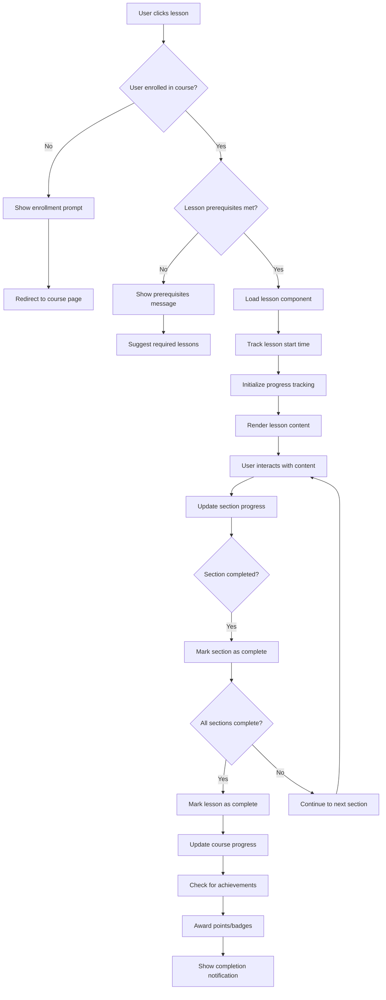

**Detailed Progress Tracking:**

1. **Section-Level Tracking**
   - Text sections: Viewed for 3+ seconds
   - Video sections: Watched 90%+ of duration
   - Code sections: Code executed successfully
   - Quiz sections: Completed with passing score

2. **Lesson-Level Completion**
   - All sections marked complete
   - Minimum time threshold met
   - All quizzes passed (if required)

3. **Real-time Updates**
   - Progress saved every 30 seconds
   - Immediate updates on section completion
   - Sync across multiple browser tabs

### Video Playback Flow

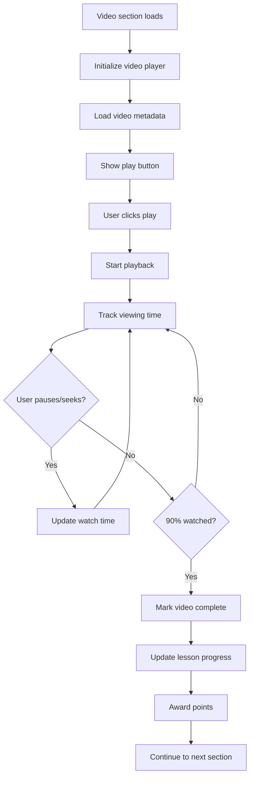

**Video Progress Features:**
- Resume from last position
- Playback speed control
- Automatic quality adjustment
- Captions/subtitles support
- Download for offline viewing (premium)

### Quiz Submission Flow

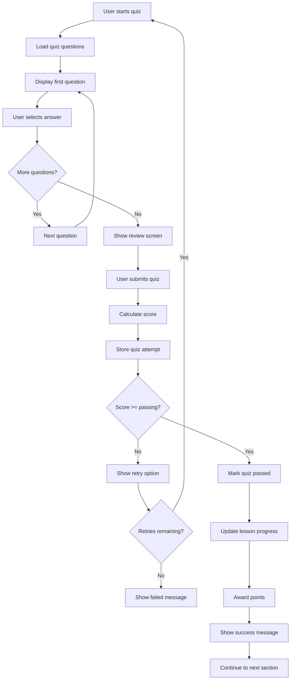

**Quiz Features:**
- Multiple question types (multiple choice, multiple select, true/false)
- Immediate feedback (optional)
- Question randomization
- Time limits (optional)
- Multiple attempts with decreasing points
- Detailed explanations for incorrect answers

## Dashboard and Analytics Flow

### Student Dashboard Flow

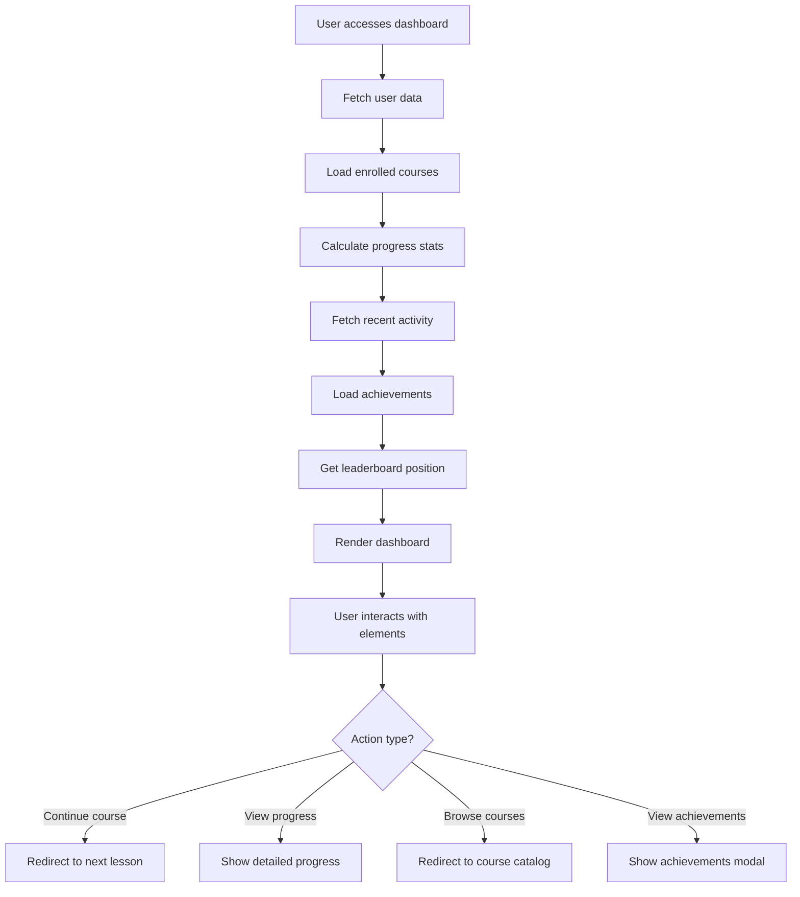

**Dashboard Components:**
- Progress overview (courses, lessons, time spent)
- Continue learning section (incomplete courses)
- Recent achievements and badges
- Learning streak counter
- Upcoming deadlines (if applicable)
- Recommended courses
- Quick stats (total points, rank, courses completed)

### Admin Analytics Flow

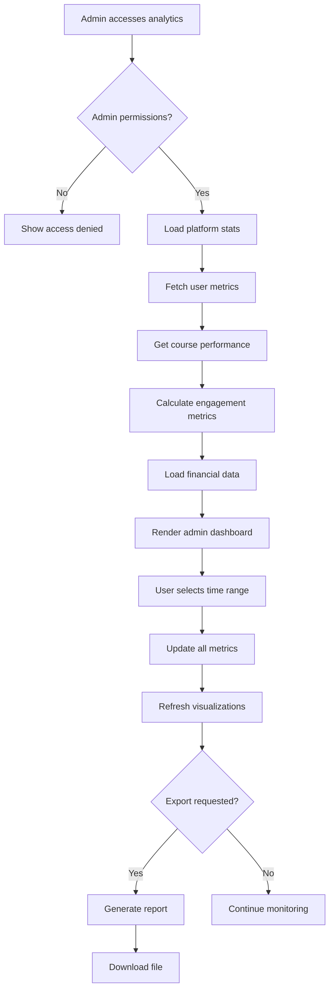

**Analytics Metrics:**
- User acquisition and retention
- Course completion rates
- Average time per lesson
- Revenue metrics (premium courses)
- Popular content and drop-off points
- Geographic distribution
- Device and browser analytics

## Gamification System Flow

### Achievement System Flow

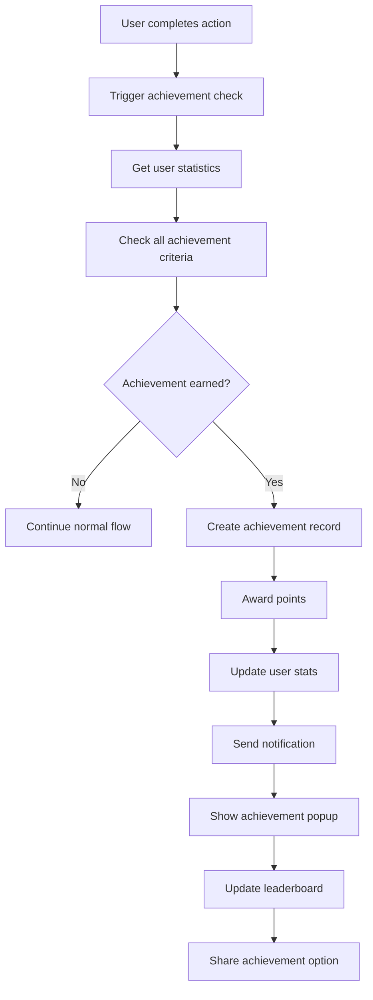

**Achievement Types:**
- Course completion badges
- Streak achievements (daily login, weekly study)
- Quiz master (high scores)
- Early bird (first to complete new course)
- Perfectionist (100% lesson completion)
- Social achievements (referrals, reviews)

### Points and Leaderboard Flow

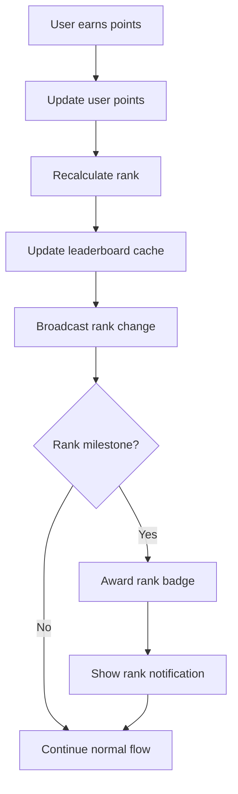

**Point System:**
- Lesson completion: 10-50 points (based on difficulty)
- Quiz completion: 20-100 points (based on score)
- Course completion: 100-500 points
- Daily login: 5 points
- Streak bonuses: 2x multiplier
- Perfect quiz: Bonus 50 points

## Error Handling and Recovery

### Network Error Recovery

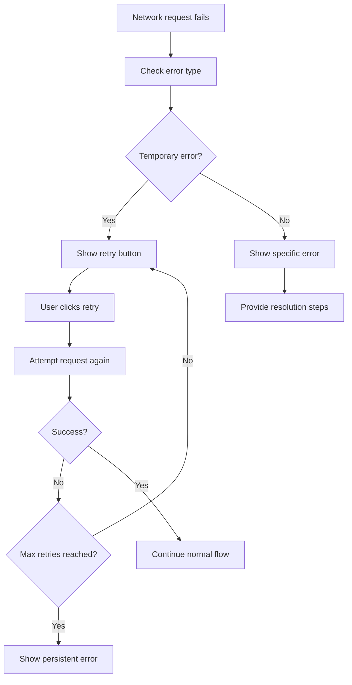

### Data Sync and Offline Support

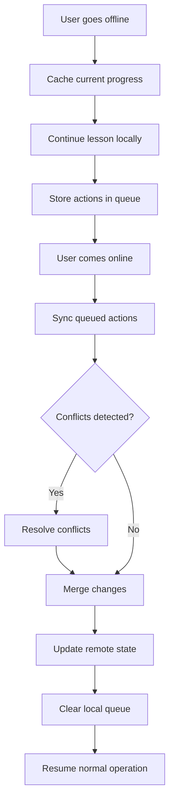

## Content Management Flow

### Course Creation Flow (Instructor)

```mermaid
graph TD
    A[Instructor creates course] --> B[Fill course details]
    B --> C[Upload thumbnail]
    C --> D[Set pricing/access]
    D --> E[Create first lesson]
    E --> F[Add lesson content]
    F --> G[Configure quiz (if any)]
    G --> H[Preview lesson]
    H --> I{Content satisfactory?}
    I -->|No| J[Edit content]
    J --> F
    I -->|Yes| K[Add more lessons]
    K --> L{Course complete?}
    L -->|No| E
    L -->|Yes| M[Review entire course]
    M --> N[Submit for approval]
    N --> O[Admin reviews course]
    O --> P{Approved?}
    P -->|No| Q[Request changes]
    Q --> J
    P -->|Yes| R[Publish course]
    R --> S[Notify instructor]
    S --> T[Course available to students]
```

### Lesson Component Deployment

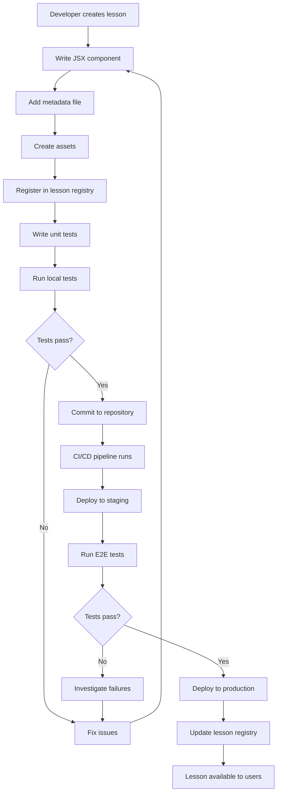

## Performance and Monitoring

### Real-time Performance Monitoring

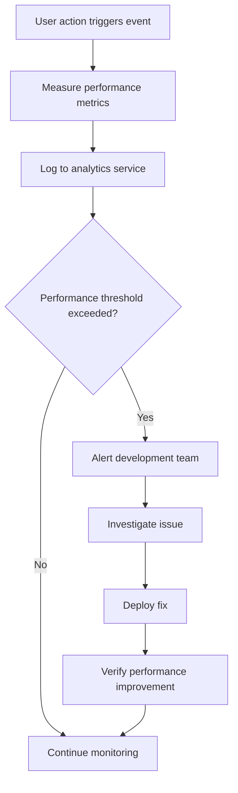

**Monitored Metrics:**
- Page load times
- API response times
- Video buffering events
- Quiz submission delays
- Database query performance
- Error rates and types

This comprehensive flow documentation ensures all team members understand the system's behavior and can implement features consistently with proper error handling and user experience considerations.